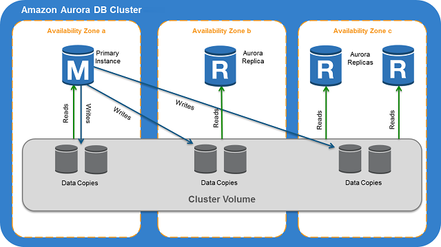
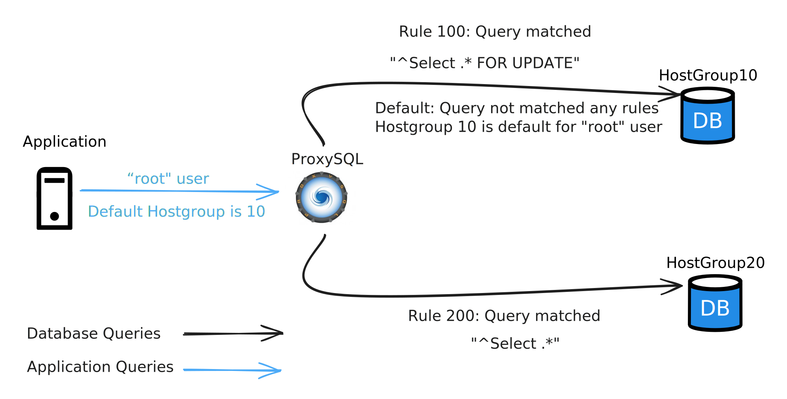

# ProxySQL 入门篇

Aurora 是 Amazon 旗下一款商业数据库产品，是一个兼容 MySQL 和 PostgreSQL 的关系数据库引擎。Aurora 集群由主数据库实例（Primary DB Instance）和副本（Replica）实例构成，其中主数据库实例支持读取和写入操作，Aurora 副本则仅支持读取（ready\_only）操作。当主数据库实例不可用时，Aurora 自动故障转移到 Aurora 副本。

<figure><figcaption><p>Amazon Aurora DB clusters</p></figcaption></figure>

我们在使用 Aurora 的过程中发现，大部分流量都导向了Primary DB Instance，副本节点之间的流量并不均匀，因此没有很好地利用 Aurora 副本的高性能读数据的能力。为了解决这个问题我们能想到的思路有两个，一个是通过封装 SDK 的模式，另一个是引入一个 Proxy 来集中处理。

下面我们将进入 ProxySQL， Proxy 模式下的一个实现。

## ProxySQL 初识

ProxySQL是一个基于 MySQL 的开源中间件产品，具有多项功能和特性，如读写分离、Query 路由、动态缓存、故障切换等。以下是从官方网站内容中总结出的 ProxySQL 的主要特性：

1. **读写分离**：支持实现读写分离，可以有效分流数据库负载。
2. **Query路由**：具备灵活的 Query 路由功能，可以根据规则对 SQL 语句进行路由，支持基于用户、schema、语句等多种规则。
3. **动态缓存**：提供查询缓存功能，当在指定时间大小范围内发送的 SQL 相同时，直接返回结果集，但需要设置合适的时间范围以确保准确性。
4. **故障切换**：支持故障切换功能，确保系统在出现故障时能够自动切换到备用状态。
5. **灵活配置**：ProxySQL 采用三层配置系统，包括 RUNTIME、MEMORY 和 DISK/CONFIG FILE，允许在 MEMORY 层进行配置修改而不影响生产环境，并能持久化配置信息。
6. **高性能**：采用先进的多核架构，支持数十万并发连接，可复用到数千台服务器。

ProxySQL 支持与以下数据库完全兼容：Amazon (AWS) Aurora, Amazon RDS, Oracle MySQL, InnoDB Cluster & Group Replication, NDB Cluster, Galera Cluster, MariaDB Server, Percona Server & XtraDB Cluster.

## 环境构建

### 构建 MySQL 集群

我们这里使用了 [vbabak/docker-mysql-master-slave](https://github.com/vbabak/docker-mysql-master-slave) 仓库来部署一个简单的**一主一从**的 MySQL 集群。具体步骤如下：

```bash
git clone https://github.com/vbabak/docker-mysql-master-slave.git
cd docker-mysql-master-slave
./build.sh
```

等待一会后，环境就部署成功了。我们可用通过 `docker-compose ps` 来查看 MySQL 集群的容器

<pre><code><strong>docker-compose ps
</strong><strong>CONTAINER ID  IMAGE                        COMMAND     CREATED        STATUS        PORTS                   NAMES
</strong>e7f8b93dabd6  docker.io/library/mysql:8.0  mysqld      2 minutes ago  Up 2 minutes  0.0.0.0:4406->3306/tcp  mysql_master
dc83ac9a0646  docker.io/library/mysql:8.0  mysqld      2 minutes ago  Up 2 minutes  0.0.0.0:5506->3306/tcp  mysql_slave
</code></pre>

最后，我们还需要将 slave 节点的 read\_only 改为 1。

<pre class="language-sql"><code class="lang-sql"><strong>SET GLOBAL read_only = 1
</strong></code></pre>

### 构建 ProxySQL&#x20;

#### 前置条件

首先我们需要构建出一个 ProsySQL 的镜像，为此创建一个 Dockerfile 文件，内容如下所示：

```docker
FROM ubuntu:jammy

ENV VERSION 2.6.0

RUN apt-get update && \
    apt-get install -y wget mysql-client inotify-tools procps && \
    wget https://github.com/sysown/proxysql/releases/download/v${VERSION}/proxysql_${VERSION}-ubuntu22_amd64.deb -O /opt/proxysql_${VERSION}-ubuntu22_amd64.deb && \
    dpkg -i /opt/proxysql_${VERSION}-ubuntu22_amd64.deb && \
    rm -f /opt/proxysql_${VERSION}-ubuntu22_amd64.deb && \
    rm -rf /var/lib/apt/lists/*

VOLUME /var/lib/proxysql
EXPOSE 6032 6033 6080

COPY entrypoint.sh /entrypoint.sh
ENTRYPOINT ["bash","/entrypoint.sh"]
```

以及一个 entroypoint.sh 文件，内容如下：

```bash
#!/bin/bash
set -e

## ProxySQL entrypoint
## ===================
##
## Supported environment variable:
##
## MONITOR_CONFIG_CHANGE={true|false}
## - Monitor /etc/proxysql.cnf for any changes and reload ProxySQL automatically

# If command has arguments, prepend proxysql
if [ "${1:0:1}" == '-' ]; then
	CMDARG="$@"
fi

if [ $MONITOR_CONFIG_CHANGE ]; then

	echo 'Env MONITOR_CONFIG_CHANGE=true'
	CONFIG=/etc/proxysql.cnf
	oldcksum=$(cksum ${CONFIG})

	# Start ProxySQL in the background
	proxysql --reload -f $CMDARG &

	echo "Monitoring $CONFIG for changes.."
	inotifywait -e modify,move,create,delete -m --timefmt '%d/%m/%y %H:%M' --format '%T' ${CONFIG} | \
	while read date time; do
		newcksum=$(cksum ${CONFIG})
		if [ "$newcksum" != "$oldcksum" ]; then
			echo "++++++++++++++++++++++++++++++++++++++++++++++++++++++"
			echo "At ${time} on ${date}, ${CONFIG} update detected."
			echo "++++++++++++++++++++++++++++++++++++++++++++++++++++++"
			oldcksum=$newcksum
			echo "Reloading ProxySQL.."
		        killall -15 proxysql
			proxysql --initial --reload -f $CMDARG
		fi
	done
fi

# Start ProxySQL with PID 1
exec proxysql -f $CMDARG
```

在 Dockerfile 文件同目录下使用以下命令进行镜像构建：

```bash
docker build -t proxysql:2.6.0 . # 构建镜像
```

#### 运行 ProxySQL

创建一个 proxysql.cnf 文件，该文件内容如下所示：

```ini
datadir="/var/lib/proxysql"

admin_variables=
{
    admin_credentials="admin:admin"
    mysql_ifaces="0.0.0.0:6032"
    refresh_interval=2000
}

mysql_variables=
{
    threads=4
    max_connections=2048
    default_query_delay=0
    default_query_timeout=36000000
    have_compress=true
    poll_timeout=2000
    interfaces="0.0.0.0:6033;/tmp/proxysql.sock"
    default_schema="information_schema"
    stacksize=1048576
    server_version="5.1.30"
    connect_timeout_server=10000
    monitor_history=60000
    monitor_connect_interval=200000
    monitor_ping_interval=200000
    ping_interval_server_msec=10000
    ping_timeout_server=200
    commands_stats=true
    sessions_sort=true
    monitor_username="root"
    monitor_password="111"
}

mysql_replication_hostgroups =
(
    { writer_hostgroup=10 , reader_hostgroup=20 , comment="host groups" }
)

mysql_servers =
(
    { address="192.168.1.160" , port=4406 , hostgroup=10, max_connections=100 , max_replication_lag = 5 },
    { address="192.168.1.160" , port=5506 , hostgroup=20, max_connections=100 , max_replication_lag = 5 }
)

mysql_query_rules =
(
    {
        rule_id=100
        active=1
        match_pattern="^SELECT .* FOR UPDATE"
        destination_hostgroup=10链接
        apply=1
    },
    {
        rule_id=101
        active=1
        match_pattern="\/\*\+\sforce-write\s\*\/"
        destination_hostgroup=10
        apply=1
    },
    {
        rule_id=200
        active=1
        match_pattern="^SELECT .*"
        destination_hostgroup=20
        apply=1
    },
    {
        rule_id=300
        active=1
        match_pattern=".*"
        destination_hostgroup=10
        apply=1
    }
)

mysql_users =
(
    { username = "root" , password = "111" , default_hostgroup = 10 , active = 1 }
)
```

恭喜您，离成功只差最后一步啦！！！使用以下命令启动单节点 ProxySQL：

```bash
docker run -d \
  --name proxysql-demo \
  --publish 6033:6033 \
  --publish 6032:6032 \
  --publish 6080:6080 \
  --restart=unless-stopped \
  -v ./proxysql.cnf:/etc/proxysql.cnf \
  localhost/proxysql:2.6.0
```

## 功能验证

### 读写分离



我们将使用 tshark 来抓包，以证明 SQL 请求走向哪个 MySQL 节点。命令如下，拦截 4406 和 5506 两个端口，并将 tcp frame 以 MySQL 协议解析。


```bash
docker run -ti --rm \
  --user=root \
  --privileged \
  --cap-add=all \
  --network=host \
  nicolaka/netshoot \
  tshark -Y "mysql.query" -d tcp.port==5506,mysql -dtcp.port==4406,mysql -T fields -e frame.time -e tcp.dstport -e mysql.query
```


测试结果如下：

```
❯ docker run --privileged -ti --rm --user=root --cap-add=all --net=host nicolaka/netshoot tshark  -Y "mysql.query"  -d tcp.port==5506,mysql -dtcp.port==4406,mysql -T fields -e frame.time -e tcp.dstport -e mysql.query |grep code
Mar 18, 2024 02:10:30.277558598 UTC	5506	select * from mydb.code
Mar 18, 2024 02:10:37.859235693 UTC	4406	select * from mydb.code for update
```

我们可以看到 FOR UPDATE 这条 SQL 请求到了 4406 端口，即读写节点。而一般的查询 SQL 请求到了 5506，即只读节点。

此外，ProxySQL 还提供了 stats\_mysql\_query\_digest 表来查看 SQL 请求与 Hostgroup 的关系。

```bash
docker exec -ti proxysql-demo mysql -uadmin -padmin --host=127.0.0.1 --port=6032 -e 'select hostgroup,schemaname,username,digest_text,count_star from  stats_mysql_query_digest'

--- output ---

+-----------+--------------------+----------+------------------------------------+------------+
| hostgroup | schemaname         | username | digest_text                        | count_star |
+-----------+--------------------+----------+------------------------------------+------------+
| 20        | information_schema | root     | select * from mydb.code            | 1          |
| 10        | information_schema | root     | show tables                        | 1          |
| 20        | information_schema | root     | SELECT DATABASE()                  | 1          |
| 10        | information_schema | root     | select * from mydb.code for update | 1          |
| 10        | information_schema | root     | show databases                     | 1          |
| 10        | information_schema | root     | select @@version_comment limit ?   | 3          |
+-----------+--------------------+----------+------------------------------------+------------+

```

### Hint 高级用法

在上述 proxysql.cnf 文件中，我们可以看到 rules 中有一条 rule\_id=101 的规则。这条规则的目的是将包含 `/*+ force-write */` Hint 的 SQL 转发到 Hostgroup=10 的组中。以此来达到不同的编程语言通过 Hint 特性来灵活地选择后端哪个 MySQL 节点。

验证如下，可以看到加了 Hint 的 SQL 的目的端口为 4406。

```
podman run --privileged -ti --rm --user=root --cap-add=all --net=host nicolaka/netshoot tshark  -Y "mysql.query"  -d tcp.port==5506,mysql -dtcp.port==4406,mysql -T fields -e frame.time -e tcp.dstport -e mysql.query |grep code
Mar 18, 2024 02:10:30.277558598 UTC	5506	select * from mydb.code
Mar 18, 2024 02:10:37.859235693 UTC	4406	select * from mydb.code for update
Mar 18, 2024 02:28:50.863802204 UTC	4406	select * /*+ force-write */ from mydb.code
```

### 监控

ProxySQL 提供了一个简单的 HTTP Web Server 来展示监控的信息。您可以配置 `admin-web_enabled=true` 来激活它。具体方式如下：


```bash
docker exec -ti proxysql-demo mysql -uadmin -padmin --host=127.0.0.1 --port=6032 -e 'SET admin-web_enabled=true;LOAD ADMIN VARIABLES TO RUNTIME;'
```


在浏览器中访问 [https://localhost:6080](https://localhost:6080)，默认用户名和密码是 stats:stats。

<figure><figcaption><p>HTTP Web Server | ProxySQL</p></figcaption></figure>

## 参考书目

1. How to configure ProxySQL for the first time， [链接](https://proxysql.com/documentation/proxysql-configuration/)
2. How to set up ProxySQL Read/Write Split，[链接](https://proxysql.com/documentation/proxysql-read-write-split-howto/)
3. HTTP Web Server | Proxy, [链接](https://proxysql.com/documentation/http-web-server/)
4. Admin Variables | ProxySQL，[链接](https://proxysql.com/documentation/global-variables/admin-variables/)
5. Docker MySQL master-slave replication，[链接](https://github.com/vbabak/docker-mysql-master-slave)
6. Docker images | ProxySQL，[链接](https://github.com/severalnines/proxysql-docker/tree/master)
7. GORM - Hints，[链接](https://gorm.io/docs/hints.html)
8. Docker cluster for testing with ProxySQL and MySQL (docker-compose)，[链接](https://github.com/pondix/docker-mysql-proxysql)
