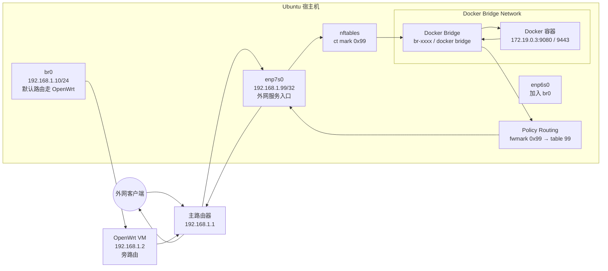
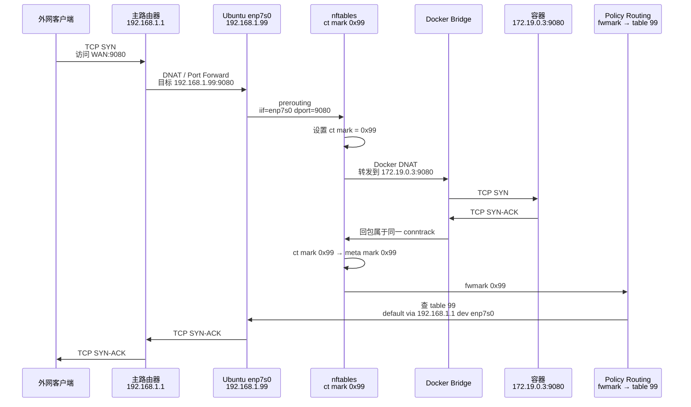

# 【补充篇】OpenWrt 旁路由实践：解决 Docker 服务外网访问无响应的问题

在上一篇 OpenWrt 旁路由实践中，我已经完成了 Ubuntu 宿主机、OpenWrt 虚拟机和主路由器之间的基础网络配置。

整体目标是：

* Ubuntu 宿主机默认流量走 OpenWrt 旁路由
* OpenWrt 作为虚拟机运行在宿主机上
* 宿主机通过网桥 `br0` 和 OpenWrt 虚拟机共享物理网卡
* 外网访问宿主机服务时，希望从另一张物理网卡 `enp7s0` 进出

基础方案跑起来后，普通出站访问没有问题，但在暴露 Docker 容器服务时，又遇到了一个新的问题：

> Docker 容器已经监听端口，请求也能进来，但外网客户端没有响应。

这篇文章记录这个问题的排查过程、根因分析和最终解决方案。

***

### 一、网络背景

宿主机是 Ubuntu，有两张物理网卡：

| 接口         | 角色                         | IP                |
| ---------- | -------------------------- | ----------------- |
| `enp6s0`   | 加入网桥 `br0`，与 OpenWrt 虚拟机共用 | 无独立 IP            |
| `br0`      | Ubuntu 宿主机主网络接口            | `192.168.1.10/24` |
| `enp7s0`   | 专门用于外网访问宿主机服务              | `192.168.1.99/32` |
| OpenWrt VM | 旁路由                        | `192.168.1.2/24`  |
| 主路由器       | 家庭主网关                      | `192.168.1.1`     |

宿主机的默认路由指向 OpenWrt：

```bash
default via 192.168.1.2 dev br0
```

也就是说，Ubuntu 主动访问外网时，流量路径是：

```
Ubuntu br0 / 192.168.1.10
  → OpenWrt 192.168.1.2
  → 主路由器 192.168.1.1
  → 外网
```

而我希望外网访问宿主机服务时，走另一条路径：

```
外网
  → 主路由器 192.168.1.1
  → Ubuntu enp7s0 / 192.168.1.99
  → Docker 服务

Docker 服务回包
  → Ubuntu enp7s0 / 192.168.1.99
  → 主路由器 192.168.1.1
  → 外网
```

***

### 二、整体架构图



这张图里有两类流量：

第一类是宿主机普通出站流量，仍然从 `br0` 走 OpenWrt 旁路由。

第二类是外网访问 Docker 服务的流量，从 `enp7s0` 进来，也必须从 `enp7s0` 回去。

***

### 三、问题现象

Docker 容器暴露了端口，例如：

```
0.0.0.0:9080
0.0.0.0:9443
```

从 `netstat` 或 `ss` 看，端口确实在监听。

但是从外网访问时，客户端没有响应。

一开始容易误判为：

* Docker 容器没有监听
* Docker 端口映射失败
* Ubuntu 防火墙拦截
* 主路由器端口转发错误

但抓包后发现，实际情况不是这样。

抓包显示，请求从 `enp7s0` 进入了宿主机：

```
外网客户端 → 192.168.1.99:9080
```

Docker 也把请求 DNAT 到了容器：

```
外网客户端 → 172.19.0.3:9080
```

容器也正常返回了 SYN-ACK：

```
172.19.0.3:9080 → 外网客户端
```

但是最终宿主机把回包从 `br0` 发出去了：

```
192.168.1.99:9080 → 外网客户端
出接口：br0
```

这就是问题的关键。

***

### 四、根因分析：Docker bridge 回包没有命中源地址策略路由

之前我已经配置过一条源地址策略路由：

```bash
from 192.168.1.99 lookup 99
```

期望是：

```
只要源地址是 192.168.1.99，就查 table 99，从 enp7s0 走 192.168.1.1
```

这个规则对宿主机本地进程通常有效。

但是 Docker bridge 端口映射场景更复杂。

Docker 默认 bridge 网络会做 DNAT/SNAT，大致路径是：

```
外网客户端
  → 192.168.1.99:9080
  → Docker DNAT
  → 172.19.0.3:9080
  → 容器回包
  → Docker SNAT/MASQUERADE
  → 192.168.1.99:9080
```

问题在于，Linux 做路由决策时，包的源地址、连接状态、NAT 转换和策略路由的时机并不总是符合我们直觉。

在这个场景里，单纯依赖：

```bash
from 192.168.1.99 lookup 99
```

并不能稳定地让 Docker 容器回包走 `table 99`。

最终结果就是：

```
请求从 enp7s0 进来
响应从 br0 出去
```

这条连接的入站和出站路径不一致，外网客户端自然收不到正确响应。

***

### 五、解决思路：用 nftables 给连接打 mark

这个问题的本质是：

> 我们需要识别“从 enp7s0 进来的 Docker 服务连接”，并强制它的回包使用指定路由表。

因此，最终方案是：

1. 外网请求从 `enp7s0` 进入时，如果目标是 `192.168.1.99:9080` 或 `192.168.1.99:9443`，就给这条连接打 `ct mark`
2. 容器回包属于同一条 conntrack 连接，继续携带这个 `ct mark`
3. 在 `prerouting` 阶段把 `ct mark` 恢复成 `meta mark`
4. Linux policy routing 根据 `fwmark` 查 `table 99`
5. `table 99` 中默认路由指向 `192.168.1.1 dev enp7s0`
6. 回包从 `enp7s0` 返回主路由器

最终逻辑是：

```
enp7s0 进来的 9080 / 9443 连接
  → ct mark 0x99
  → meta mark 0x99
  → fwmark 0x99
  → table 99
  → enp7s0
  → 192.168.1.1
```

***

### 六、流量走向图



这张图的核心是：**不是靠 Docker bridge 名字识别回包，而是靠 conntrack mark 识别整条连接。**

这样即使 Docker 自动生成的 bridge 名称变化，也不会影响规则。

***

### 七、Netplan 最终配置

我的 `enp7s0` 使用 `192.168.1.99/32`，并配置单独的 `table 99`。

示例配置如下：

```yaml
network:
  version: 2
  renderer: networkd

  ethernets:
    enp6s0:
      dhcp4: false
      dhcp6: false
      optional: true

    enp7s0:
      dhcp4: false
      dhcp6: false
      optional: true
      addresses:
        - 192.168.1.99/32
      routes:
        - to: 192.168.1.0/24
          scope: link
          table: 99
        - to: default
          via: 192.168.1.1
          table: 99
      routing-policy:
        - from: 0.0.0.0/0
          mark: 153
          table: 99
          priority: 98

        - from: 192.168.1.99/32
          table: 99
          priority: 99

  bridges:
    br0:
      interfaces:
        - enp6s0
      dhcp4: false
      dhcp6: false
      addresses:
        - 192.168.1.10/24
      routes:
        - to: default
          via: 192.168.1.2
      nameservers:
        addresses:
          - 192.168.1.1
          - 223.5.5.5
      parameters:
        stp: false
        forward-delay: 0
```

这里有几个重点。

#### 1. `br0` 的默认路由仍然指向 OpenWrt

```yaml
routes:
  - to: default
    via: 192.168.1.2
```

这保证 Ubuntu 宿主机普通出站流量仍然走 OpenWrt 旁路由。

#### 2. `enp7s0` 使用独立策略路由表

```yaml
routes:
  - to: 192.168.1.0/24
    scope: link
    table: 99
  - to: default
    via: 192.168.1.1
    table: 99
```

这表示 `table 99` 里的默认出口是：

```
default via 192.168.1.1 dev enp7s0
```

#### 3. `mark: 153` 对应 nftables 里的 `0x99`

Netplan 的 `mark` 字段使用十进制整数。

`0x99` 转成十进制是：

```
153
```

所以 Netplan 里写：

```yaml
mark: 153
```

而 nftables 里可以继续写：

```nft
0x99
```

两者是同一个值。

#### 4. 部分 Netplan 版本要求 routing-policy 带 from 或 to

有些 Netplan 版本不允许只写：

```yaml
- mark: 153
  table: 99
  priority: 98
```

会提示：

```
IP routing policy must include either a 'from' or 'to' IP
```

所以这里使用：

```yaml
- from: 0.0.0.0/0
  mark: 153
  table: 99
  priority: 98
```

语义是：

```
任意 IPv4 源地址，只要 fwmark = 153，就查 table 99
```

***

### 八、nftables 最终配置

保留系统默认 `/etc/nftables.conf` 不动，**不要把你的 Docker PBR 规则写进这个文件里**，也不要通过 `restart nftables` 来重载它。

单独放一个文件：

```shellscript
sudo mkdir -p /etc/nftables.d
sudo nano /etc/nftables.d/docker-pbr.nft
```

内容：

```
table inet docker_pbr {
  set wan_ports {
    type inet_service
    elements = { 9080, 9443 }
  }

  chain prerouting {
    type filter hook prerouting priority mangle; policy accept;

    # 原始入站方向：只给连接打 ct mark，不设置 meta mark
    # 这样 Docker DNAT 后，包仍然可以按主路由表进入 Docker bridge
    iifname "enp7s0" ip daddr 192.168.1.99 tcp dport @wan_ports ct mark set 0x99

    # 回复方向：只对 conntrack reply 方向恢复 meta mark
    # 这样只有容器回包才会命中 fwmark 策略路由
    ct mark 0x99 ct direction reply meta mark set ct mark
  }
}
```

然后用单独的 systemd service 加载它：

```shellscript
sudo nano /etc/systemd/system/docker-pbr-nft.service
```

写入：

```ini
[Unit]
Description=Load nftables rules for Docker policy routing
After=network-online.target docker.service
Wants=network-online.target
Requires=docker.service

[Service]
Type=oneshot
ExecStartPre=-/usr/sbin/nft delete table inet docker_pbr
ExecStart=/usr/sbin/nft -f /etc/nftables.d/docker-pbr.nft
RemainAfterExit=yes

[Install]
WantedBy=multi-user.target
```

启用：

```shellscript
sudo systemctl daemon-reload
sudo systemctl enable --now docker-pbr-nft.service
```

之后修改规则时，用：

```shellscript
sudo systemctl restart docker-pbr-nft.service
```

不要用：

```shellscript
sudo systemctl restart nftables
```

### 当前已经报错后的恢复顺序

先让 Docker 重建自己的链：

```shellscript
sudo systemctl restart docker
```

再加载你的 PBR nft 规则：

```shellscript
sudo systemctl restart docker-pbr-nft.service
```

再启动 compose：

```shellscript
docker compose up -d
```

验证：

```shellscript
sudo iptables -t filter -S DOCKER-FORWARD
sudo nft list table inet docker_pbr
```

### 也可以选择禁用 nftables.service

如果你没有用系统防火墙，只是为了这条 PBR 规则，甚至可以让默认的 `nftables.service` 不参与启动：

```shellscript
sudo systemctl disable nftables
```

然后只保留：

```
docker-pbr-nft.service
```

这样不会在启动或重启时误清 Docker 链。

我的建议是：**默认 `/etc/nftables.conf` 可以保留，但不要动它；你的规则用独立 service 管理。**

***

### 九、为什么不匹配 Docker bridge 名称？

一开始抓包里能看到 Docker bridge 名称类似：

```
br-6516513311d9
```

但是这个名字是 Docker 自动生成的。只要 Docker network 被删除重建，bridge 名称就可能变化。

如果 nftables 写成：

```nft
iifname "br-6516513311d9" ct mark 0x99 meta mark set ct mark
```

那么后续 Docker network 一变，规则就失效了。

因此，更好的方式是：

```nft
ct mark 0x99 meta mark set ct mark
```

这条规则不关心包来自哪个 Docker bridge。

它只关心一件事：

> 这条连接之前是否已经被明确打过 `ct mark 0x99`。

如果是，就恢复 `meta mark`，让策略路由继续生效。

这样规则和 Docker 自动生成的 bridge 名称解耦，更稳定，也更适合长期维护。

***

### 十、应用配置

修改 Netplan 后，先执行：

```bash
sudo netplan try
```

确认没有问题后再执行：

```bash
sudo netplan apply
```

修改 nftables 后执行：

```bash
sudo nft -f /etc/nftables.conf
```

或者：

```bash
sudo systemctl restart nftables
```

***

### 十一、验证策略路由

查看策略路由规则：

```bash
ip rule
```

期望看到类似：

```
98: from all fwmark 0x99 lookup 99
99: from 192.168.1.99 lookup 99
```

查看 `table 99`：

```bash
ip route show table 99
```

期望看到：

```
192.168.1.0/24 dev enp7s0 scope link
default via 192.168.1.1 dev enp7s0
```

测试 fwmark 路由：

```bash
ip route get 49.77.238.130 mark 0x99
```

期望结果：

```
49.77.238.130 via 192.168.1.1 dev enp7s0
```

测试源地址路由：

```bash
ip route get 49.77.238.130 from 192.168.1.99
```

期望结果：

```
49.77.238.130 via 192.168.1.1 dev enp7s0 src 192.168.1.99
```

***

### 十二、验证 nftables 是否命中

如果规则中加了 `counter`，可以查看：

```bash
sudo nft list table inet docker_pbr
```

当外网访问 `9080` 或 `9443` 时，对应 counter 应该增加。

也可以抓包验证：

```bash
sudo tcpdump -i any -n 'tcp port 9080 or tcp port 9443'
```

修复前的错误现象是：

```
enp7s0 In   外网客户端 → 192.168.1.99:9080
br0 Out     192.168.1.99:9080 → 外网客户端
```

修复后的正确现象应该是：

```
enp7s0 In   外网客户端 → 192.168.1.99:9080
enp7s0 Out  192.168.1.99:9080 → 外网客户端
```

这说明入站和出站路径已经一致。

***

### 十三、最终流量路径

#### 1. Ubuntu 宿主机普通出站访问

```
Ubuntu br0 / 192.168.1.10
  → OpenWrt 旁路由 192.168.1.2
  → 主路由器 192.168.1.1
  → 外网
```

这条路径不受 nftables mark 影响。

#### 2. 外网访问 Docker 服务

```
外网客户端
  → 主路由器端口转发
  → Ubuntu enp7s0 / 192.168.1.99:9080
  → Docker DNAT
  → 容器 172.19.0.3:9080
```

回包路径：

```
容器 172.19.0.3:9080
  → Docker bridge
  → nftables 恢复 meta mark 0x99
  → fwmark 0x99 命中 table 99
  → enp7s0
  → 主路由器 192.168.1.1
  → 外网客户端
```

***

### 十四、总结

这次问题的根因不是 Docker 没有监听端口，也不是主路由器端口转发失败，而是：

> 在 OpenWrt 旁路由场景下，Ubuntu 宿主机默认路由指向 `192.168.1.2`，Docker bridge 容器回包没有稳定命中 `from 192.168.1.99` 的策略路由，导致响应包从 `br0` 出去。

最终解决方式是：

```
nftables ct mark
+
fwmark policy routing
+
table 99 default via 192.168.1.1 dev enp7s0
```

也就是：

```
从 enp7s0 进来的外网服务连接
  → 打连接标记
  → 回包恢复 mark
  → 策略路由查 table 99
  → 从 enp7s0 返回
```

这个方案的优点是：

1. 保留 Docker bridge 网络模式
2. 不需要使用 `network_mode: host`
3. 不依赖 Docker 自动生成的 bridge 名称
4. 不破坏宿主机默认走 OpenWrt 的旁路由配置
5. 入站和回包路径清晰一致
6. 后续增加端口时，只需要维护 nftables 里的 `wan_ports` set

对于“Ubuntu 宿主机 + OpenWrt 虚拟旁路由 + Docker bridge 服务外网暴露”这种组合场景，`ct mark + fwmark 策略路由` 是一个相对干净、稳定、可维护的解决方案。
