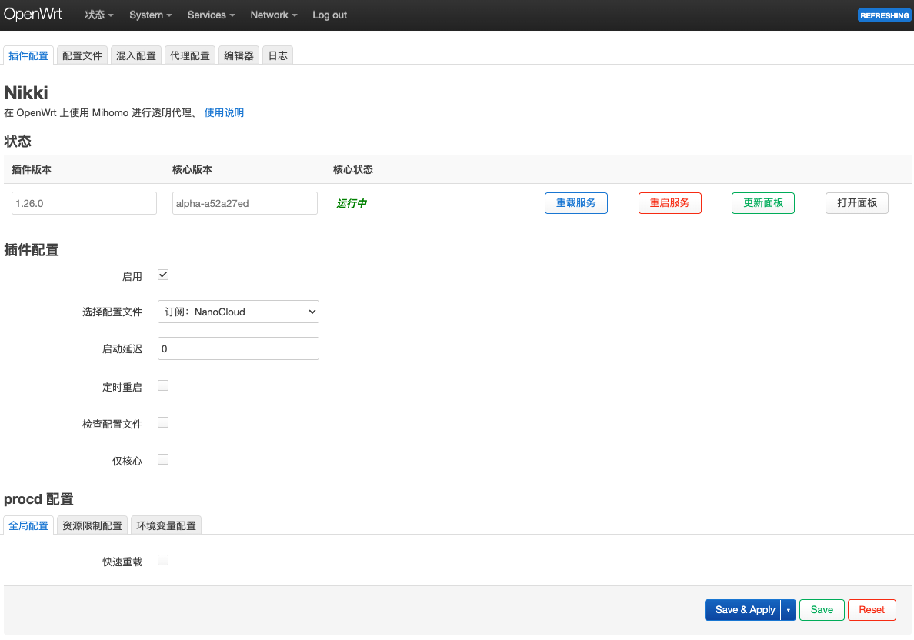

# 🔥 OpenWrt 旁路由实践

<figure><figcaption></figcaption></figure>

### 0. 目标拓扑

示例网段如下，请按你的实际 LAN 修改：

```
主路由 LAN IP:        192.168.1.1
Ubuntu 宿主机 br0:    192.168.1.10
OpenWrt VM IP:       192.168.1.2
客户端 DHCP 网关:      192.168.1.2
客户端 DNS:           192.168.1.2
物理网卡:             enp3s0
宿主机桥:             br0
```

流量路径：

```
客户端 -> OpenWrt VM 192.168.1.2 -> 主路由 192.168.1.1 -> Internet
```

这里使用 OpenWrt 的 LAN 口做同口进同口出的 IPv4 masquerade/NAT。OpenWrt x86/64 本身支持跑在 PC/VM 上，官方 x86/64 下载目录也提供 `generic-ext4-combined.img.gz` 镜像。

### 1. 宿主机安装 KVM/libvirt/Vagrant

```shellscript
sudo apt update
sudo apt install -y software-properties-common util-linux-extra ca-certificates curl wget gnupg lsb-release vim
sudo add-apt-repository -y universe
```


```shellscript
sudo apt update

sudo apt install -y \
  qemu-system-x86 qemu-utils \
  libvirt-daemon-system libvirt-clients \
  bridge-utils \
  build-essential ruby-dev libvirt-dev pkg-config \
  zlib1g-dev libxml2-dev libxslt1-dev \
  gzip tar
```

这里面：

```
qemu-system-x86       必需，x86_64 虚拟机后端
qemu-utils            必需/建议，用 qemu-img 转镜像
libvirt-daemon-system 必需，libvirt 服务端
libvirt-clients       必需，提供 virsh
bridge-utils          可选，但桥接排错有用
build-essential       vagrant-libvirt 插件编译用
ruby-dev              vagrant-libvirt 插件编译用
libvirt-dev           vagrant-libvirt 插件编译用
pkg-config            插件编译用
zlib/libxml/libxslt   Ruby native gem 编译依赖
```

根据 vagrant [官方安装文档](https://developer.hashicorp.com/vagrant/install#linux)，部署 vagrant 和 libvirt 插件：

```shellscript
wget -O - https://apt.releases.hashicorp.com/gpg | sudo gpg --dearmor -o /usr/share/keyrings/hashicorp-archive-keyring.gpg
echo "deb [arch=$(dpkg --print-architecture) signed-by=/usr/share/keyrings/hashicorp-archive-keyring.gpg] https://apt.releases.hashicorp.com $(grep -oP '(?<=UBUNTU_CODENAME=).*' /etc/os-release || lsb_release -cs) main" | sudo tee /etc/apt/sources.list.d/hashicorp.list
sudo apt update && sudo apt install vagrant
vagrant plugin list | grep libvirt
vagrant plugin install vagrant-libvirt
vagrant plugin install vagrant-none-communicator
```

验证：

```shellscript
vagrant --version
vagrant plugin list
virsh -c qemu:///system list --all
```

加组：

```shell
sudo usermod -aG libvirt,kvm "$USER"
newgrp libvirt
```

### 2. 把宿主机物理网卡改成桥接 br0

单臂路由，网卡配置，netplan 配置如下：

<pre class="language-yaml"><code class="lang-yaml">network:
  version: 2
  renderer: networkd

  ethernets:
    enp6s0:
      dhcp4: false
      dhcp6: false
      optional: true

  bridges:
    br0:
      interfaces:
<strong>        - enp6s0
</strong>      dhcp4: false
      dhcp6: false
      addresses:
        - 192.168.1.10/24
      routes:
        - to: default
          via: 192.168.1.1
      nameservers:
        addresses:
          - 192.168.1.1
          - 223.5.5.5
      parameters:
        stp: false
        forward-delay: 0
</code></pre>

```shellscript
sudo chown root:root /etc/netplan/01-br0.yaml
sudo chmod 600 /etc/netplan/01-br0.yaml
sudo systemctl restart systemd-networkd
sudo netplan apply
```

然后检查：

```shellscript
ip -br link
ip -br addr
ip route
bridge link
```

结果应该接近这样：

```
enp6s0    UP
br0       UP             192.168.1.10/24
```


### 3. 制作 OpenWrt 的 Vagrant/libvirt box

下载 OpenWrt x86/64 ext4 combined 镜像：

```shellscript
OWRT_VER="25.12.4"
IMG="openwrt-${OWRT_VER}-x86-64-generic-ext4-combined.img.gz"
RAW="${IMG%.gz}"
```

```bash
OWRT_VER="25.12.4"
IMG="openwrt-${OWRT_VER}-x86-64-generic-ext4-combined.img.gz"
RAW="${IMG%.gz}"

wget "https://downloads.openwrt.org/releases/${OWRT_VER}/targets/x86/64/${IMG}"
wget "https://downloads.openwrt.org/releases/${OWRT_VER}/targets/x86/64/sha256sums"

sha256sum -c sha256sums --ignore-missing
gunzip -k "$IMG"

```

把首次启动脚本注入 OpenWrt 镜像，避免 VM 一启动就用默认 `192.168.1.1` 和主路由冲突：

```bash
sudo mkdir -p /mnt/openwrt-root

LOOP=$(sudo losetup -Pf --show "$RAW")
sudo mount "${LOOP}p2" /mnt/openwrt-root

sudo mkdir -p /mnt/openwrt-root/etc/uci-defaults

cat <<'EOF' | sudo tee /mnt/openwrt-root/etc/uci-defaults/99-side-router >/dev/null
#!/bin/sh

# LAN 静态 IP：OpenWrt 旁路由地址
uci set network.lan.ipaddr='192.168.1.2'
uci set network.lan.netmask='255.255.255.0'
uci set network.lan.gateway='192.168.1.1'

# OpenWrt 自己的上游 DNS
uci delete network.lan.dns 2>/dev/null
uci add_list network.lan.dns='192.168.1.1'

# 禁止 eth1/wan 下发默认路由，然后让 lan/br-lan 使用主路由作为上游。
uci set network.wan.defaultroute='0'
uci set network.wan.peerdns='0'
uci set network.wan.auto='0'

# 首次启动默认关闭 OpenWrt DHCP，避免和主路由 DHCP 冲突
uci set dhcp.lan.ignore='1'

uci commit network
uci commit dhcp

# 单臂旁路由：LAN zone 开启转发和 masquerade
LAN_ZONE="$(uci show firewall | sed -n "s/^\(firewall\.[^=]*\)\.name='lan'$/\1/p" | head -n1)"

if [ -n "$LAN_ZONE" ]; then
  uci set ${LAN_ZONE}.input='ACCEPT'
  uci set ${LAN_ZONE}.output='ACCEPT'
  uci set ${LAN_ZONE}.forward='ACCEPT'
  uci set ${LAN_ZONE}.masq='1'
  uci set ${LAN_ZONE}.mtu_fix='1'
  uci commit firewall
fi

exit 0
EOF

sudo chmod +x /mnt/openwrt-root/etc/uci-defaults/99-side-router

sudo umount /mnt/openwrt-root
sudo losetup -d "$LOOP"
```

转成 qcow2：

```shellscript
qemu-img convert -f raw -O qcow2 "$RAW" box.img
```

生成 box 元数据：

```shellscript
cat > metadata.json <<'EOF'
{
  "provider": "libvirt",
  "format": "qcow2",
  "virtual_size": 1
}
EOF

cat > Vagrantfile <<'EOF'
Vagrant.configure("2") do |config|
  config.vm.provider :libvirt do |libvirt|
    libvirt.driver = "kvm"
    libvirt.disk_bus = "virtio"
    libvirt.nic_model_type = "virtio"
  end
end
EOF

tar czf openwrt-x86-64-libvirt.box metadata.json Vagrantfile box.img
vagrant box add --force --name local/openwrt-x86-64 openwrt-x86-64-libvirt.box
```

创建 `Vagrantfile`：

```ruby
Vagrant.configure("2") do |config|
  config.vm.box = "local/openwrt-x86-64"
  config.vm.hostname = "openwrt-side-router"

  config.vm.communicator = "none"
  config.ssh.insert_key = false
  config.vm.synced_folder ".", "/vagrant", disabled: true

  # OpenWrt 真正使用的 LAN 网卡：桥接到宿主机 br0
  config.vm.network :public_network,
    dev: "br0",
    mode: "bridge",
    type: "bridge",
    mac: "52:54:00:12:34:56",
    libvirt__model_type: "virtio"

  config.vm.provider :libvirt do |libvirt|                                                                                 libvirt.uri = "qemu:///system"
    libvirt.driver = "kvm"

    libvirt.memory = 256
    libvirt.cpus = 1

    libvirt.disk_bus = "virtio"
    libvirt.nic_model_type = "virtio"

    # 关键：不要再关闭 management network
    # libvirt.mgmt_attach = false

    # 保留管理网络，让 vagrant-libvirt/fog-libvirt 正常工作
    libvirt.management_network_name = "vagrant-libvirt"
    libvirt.management_network_address = "192.168.121.0/24"
    libvirt.management_network_autostart = true

    # 尽量把管理网卡排到后面，让 OpenWrt 的 LAN 桥接网卡优先成为 eth0
    libvirt.management_network_pci_bus = "0x00"
    libvirt.management_network_pci_slot = "0x09"

    libvirt.autostart = true
  end
end
```

#### 3.1 磁盘分区扩容

在 OpenWrt 内直接扩容

安装工具：

```shellscript
apk update
apk add parted losetup resize2fs blkid
```

查看当前分区：

```shellscript
parted /dev/vda print
```

扩展第 2 分区到磁盘末尾：

```shellscript
parted -s /dev/vda resizepart 2 100%
```

重启：

```shellscript
reboot
```

然后扩展 ext4 文件系统：

```shellscript
resize2fs /dev/vda2
```

如果上面报错，比如 root 正在使用，改用 loop 方式：

```shellscript
LOOP="$(losetup -f)"
losetup "$LOOP" /dev/vda2
resize2fs -f "$LOOP"
losetup -d "$LOOP"
```

最后再重启一次：

```shellscript
reboot
```

检查结果：

```shellscript
df -h
lsblk
```

成功后 `/` 应该接近 1G，例如：

```
# df -h
Filesystem                Size      Used Available Use% Mounted on
/dev/root               990.3M    109.3M    864.9M  11% /
tmpfs                   115.6M    308.0K    115.3M   0% /tmp
/dev/vda1                15.7M      5.6M      9.8M  36% /boot
/dev/vda1                15.7M      5.6M      9.8M  36% /boot
tmpfs                   512.0K         0    512.0K   0% /dev

# lsblk
NAME   MAJ:MIN RM    SIZE RO TYPE MOUNTPOINTS
vda    254:0    0      1G  0 disk
├─vda1 254:1    0     16M  0 part /boot
│                                 /boot
└─vda2 254:2    0 1007.5M  0 part /
```

### 4. Openwrt 安装 Nikki

安装软件 Nikki

<pre class="language-shellscript"><code class="lang-shellscript"># only needs to be run once
## 这一步会存在网络问题，
<strong>### export https_proxy="http://your-lan-server-ip:port"
</strong><strong>### 建议把文件 feed.sh 复制到本地 cat feed.sh | ash 来执行
</strong>wget -O - https://github.com/nikkinikki-org/OpenWrt-nikki/raw/refs/heads/main/feed.sh | ash
apk add nikki
apk add luci-app-nikki
apk add luci-i18n-nikki-zh-cn
</code></pre>

在启动时，nikki 会下载 Country.mmdb Geosite.dat

准备 country.mmdb 和 geosite.dat。文件维护在 github [MetaCubeX/meta-rules-dat](https://github.com/MetaCubeX/meta-rules-dat) 上。

```shellscript
mkdir -p /etc/nikki/run
cd /etc/nikki/run
# 下载会遇到网络问题，可以去 github 仓库使用 JSdelivr 的链接替代
wget -O Country.mmdb https://github.com/MetaCubeX/meta-rules-dat/releases/download/latest/country.mmdb
chmod 755 Country.mmdb
wget -O GeoSite.dat https://github.com/MetaCubeX/meta-rules-dat/releases/download/latest/geosite.dat
chmod 755 GeoSite.dat
```


Nikki 的配置 UI

<figure><figcaption></figcaption></figure>

<figure><figcaption></figcaption></figure>


<figure><figcaption></figcaption></figure>

<figure><figcaption></figcaption></figure>


### Tips

#### vnc 连接 openwrt 虚拟机

```shellscript
sudo virsh -c qemu:///system console openwrt_default
```

#### 手动清理虚拟机

1\. 直接删本地 `.vagrant`

在项目目录执行

```shellscript
rm -rf .vagrant
```

2. 用 virsh 查残留 VM

查看虚拟机列表，找到openwrt的虚拟机

```shellscript
sudo virsh -c qemu:///system list --all
```

找到虚拟机名称后，示例 "openwrt\_default"，删除存储资源

```shellscript
DOMAIN="openwrt_default"

sudo virsh -c qemu:///system destroy "$DOMAIN" 2>/dev/null || true
sudo virsh -c qemu:///system undefine "$DOMAIN" --remove-all-storage --nvram 2>/dev/null || \
sudo virsh -c qemu:///system undefine "$DOMAIN" --remove-all-storage 2>/dev/null || \
sudo virsh -c qemu:///system undefine "$DOMAIN"
```

3. 查并删除残留磁盘

```shellscript
sudo virsh -c qemu:///system pool-list --all
sudo virsh -c qemu:///system vol-list default | grep -Ei 'openwrt|vagrant'
```

```shellscript
sudo virsh -c qemu:///system vol-delete --pool default {}
```

